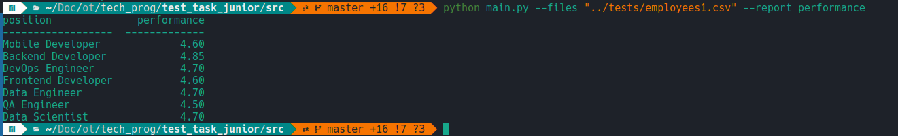
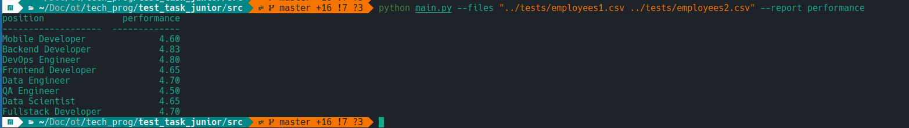
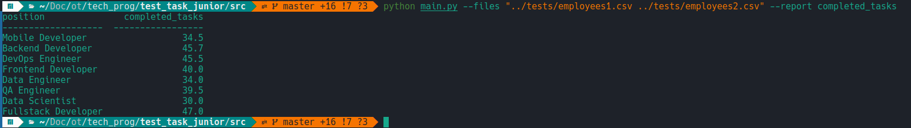
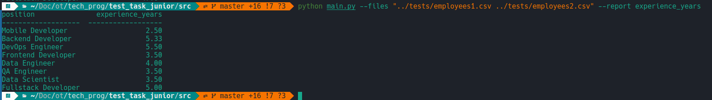
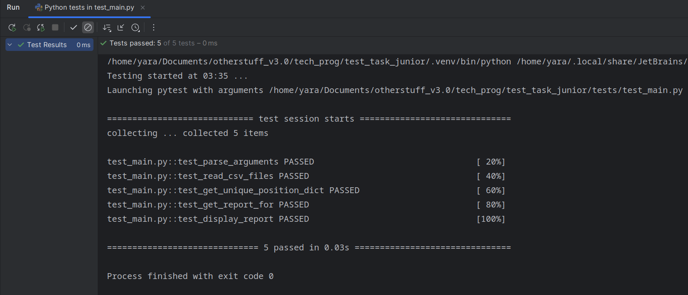

# Тестовое задание на позицию Backend Developer (Python)
## Примеры работы
Составление отчёта с одним файлом по параметру performance:

С двумя файлами по тому же параметру:

По completed tasks:

По experience_years:

## Пройденные тесты
