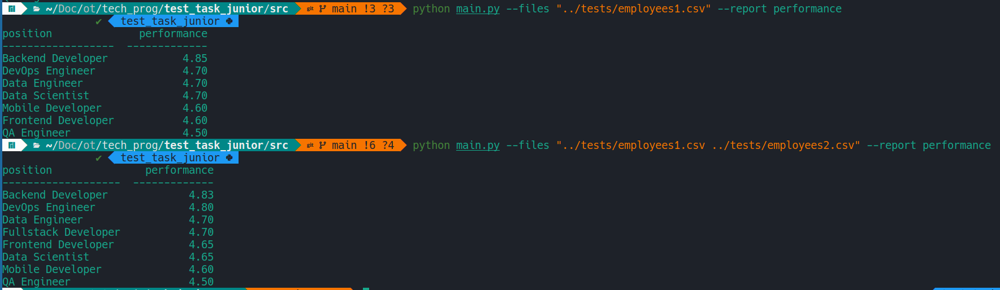
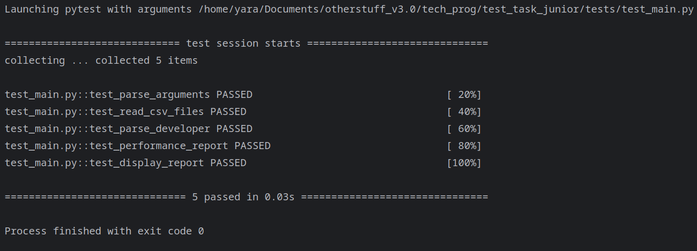

# Тестовое задание на позицию Backend Developer (Python)
## Примеры работы
Составление отчёта с одним файлом по параметру performance и с двумя файлами по тому же параметру:

## Пройденные тесты

## Добавление новых отчётов
Шаблон класса отчёта. Чтобы добавить новый, скопируйте пример PerformanceReport (src/main.py, line 80) и поменяйте логику в generate для нового класса, а также замените атрибуты name, description и header_names. После зарегистрируйте класс с помощью вызова функции register_report(ReportClassName()).
```
class Report:
    name: str
    description: str
    header_names: list[str]
    def generate(self, developers: list[Developer]) -> dict[str, str]:
        pass
```
